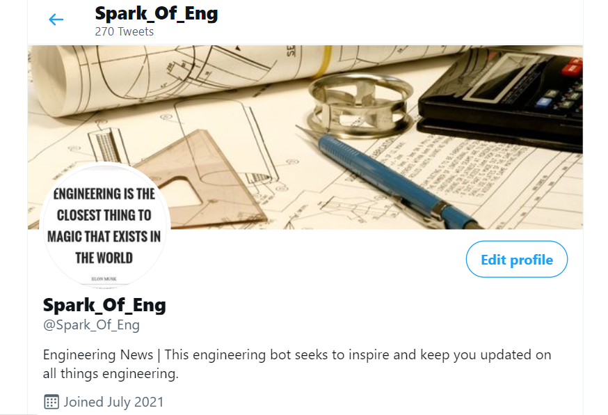

# My-Twitter-Bot
This is a friendly Twitter Bot, created with python to retweet tweets with #engineering. Its sole purpose is to inspire, promote and keep people informed of the world of engineering. Access the Twitter Bot page [here](https://twitter.com/Spark_Of_Eng).

## Screenshot

## Built With

- Python
- Wing Python IDE

## Author

:bust_in_silhouette: **Natasha Chitongo** 

GitHub: [@natashac18](https://github.com/natashac18)

## :handshake: Contributing

Contributions, issues and feature requests are welcome!

## Show your support! 

If you like this project, please give it a :star: !
